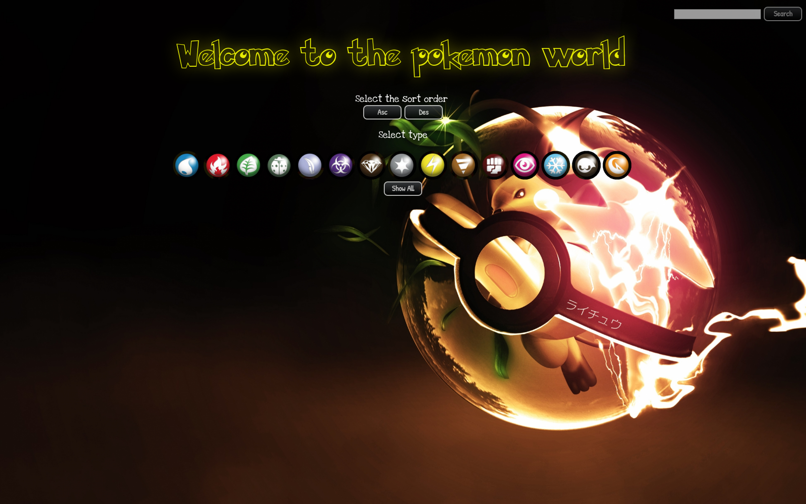
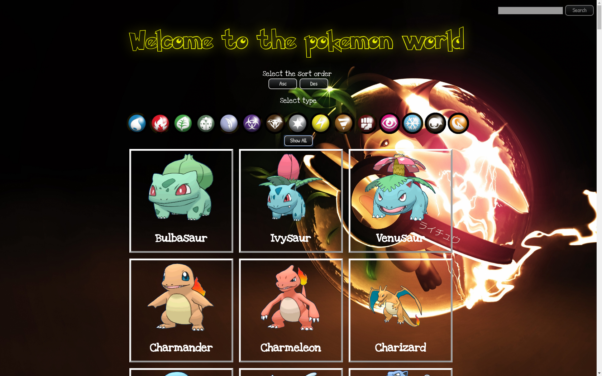
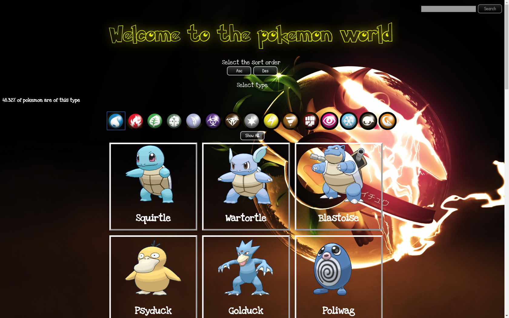
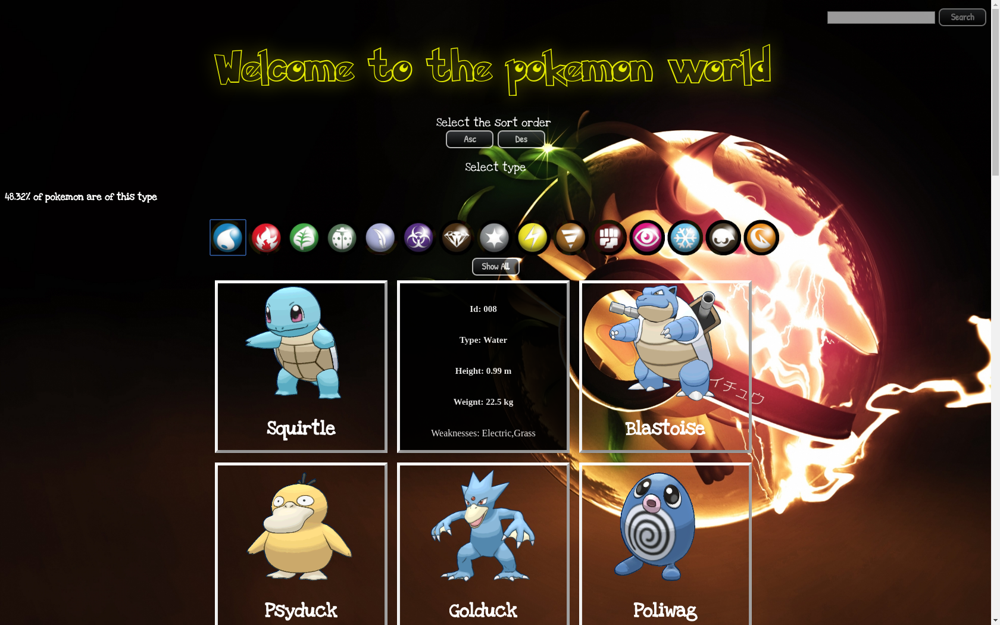
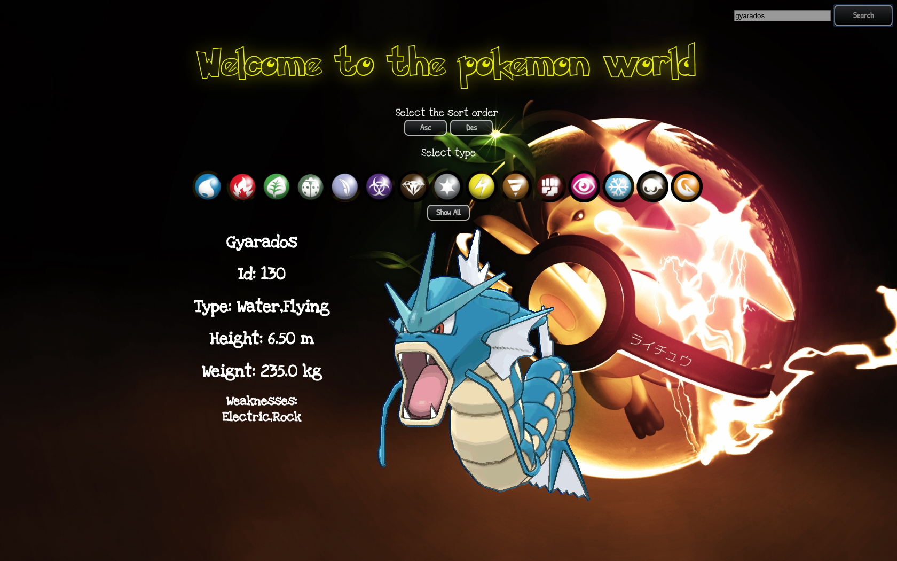
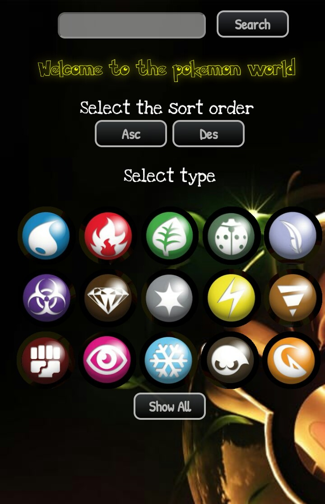
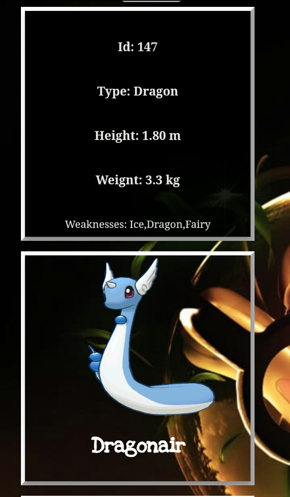
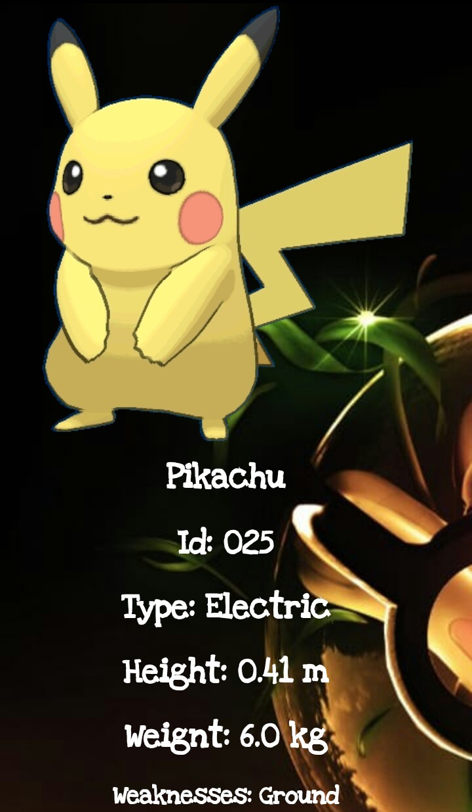

<h1> **Data Lovers** </h1>

<h2> **Welcome to the Pokemon World!!!** </h2>

La meta de este proyecto es crear una página web que permita **visualizar data, filtrarla, ordenarla y hacer algún cálculo agregado**.

Lo primero que hicimos para nuestro proyecto fue leer el "Readme" con los requerimientos del mismo. Elegimos un tema para la data, en nuestro caso fue Pokémon ya que de todas las opciones era la que nos era un poco más familiar.

Definimos cual iba a ser nuestro usuario e hicimos una pequeña y corta encuesta (a familiares y conocidos principalmente) para conocer un poco qué le gustaría encontrar en la página, y qué cosas podría resolver.

Una vez hecho esto lo resumimos en 4 historias de usuario principales y dibujamos un prototipo de baja fidelidad, pedimos feedback a nuestras compañeras y futuros usuarios e hicimos algunas modificaciones, todo esto en lápiz y papel.

Realizamos un prototipo de alta fidelidad en Figma para poder visualizar como quedaría y funcionaría nuestra página

https://www.figma.com/files/project/2956228/DataLovers

Lo siguiente fue explorar y probar con funciones para que nuestra página nos mostrara de forma ordenada a los pokemon, filtrara por tipo, y posteriormente mostrara la información ordenada en la interfaz. Pusimos un buscador que permite filtrar la información de un solo Pokemon por su nombre y mostrarlo. Además agregamos un calculo de estadística en el filtrado por tipo de pokemon.

A la par de esto le ibamos dando diseño, mejorando las imagenes que mostraba junto con la data y eligiendo los formatos y fuentes a utilizar. Hicimos unos pequeños cambios a nuestro prototipo incial pero buscando conservar la idea principal del mismo.

Por último investigamos y exploramos como darle diseño responsivo con media queries.

Una vez hecho esto comenzamos a crear los test que nos indicarían que nuestra página está funcionando correctamente, un test para la función de filtrado, uno para el ordenado, y uno para el de estadísticas.

## Definición de usuario

El usuario es una persona de 15 a 40 años que juega por primera vez pokemonGo o que empieza a seguir la serie y que desea información sobre los pokemons que va recolectando o conociendo.

## Historias de usuarios

- [ ] **Historia de usuario 1:**
El usuario requiere poder visualizar a todos los pokemones con su imagen y sus datos más importantes.

**Definition of done:**
- La interfaz tiene un botones para mostrar todo.
- Que la interfaz muestre el listado de pokémons con su data e imagen
- Que el diseño sera responsivo.
- Que la pagina donde se muestra el pokémon tenga un botón de regreso al inicio. (en proceso)
- Que pase las pruebas Unitarias. (en proceso)

- [ ] **Historia de usuario 2:**
El usuario requiere filtrar a sus pokemones por su "tipo" y que se desplieguen con su imagen y sus datos más importantes.

**Definition of done:**
- La interfaz tiene botones por "tipo de pokemon".
- Los botones filtran los pokémon deseados con su data e imagen
- Que la interfaz muestre el listado de pokémons filtrados con su data e imagen
- Que el diseño sera responsivo.
- Que la pagina donde se muestra el pokémon tenga un botón de regreso a la página de inicio. (en proceso)
- Que pase las pruebas Unitarias. (en proceso)

- [ ] **Historia de usuario 3:**
El usuario requiere un boton que ordene su listado de pokemons por id de forma ascendente  y descendente.

**Definition of done**
- La interfaz tiene botón que ordena sus datos de forma ascendente o descendente por alfabeto.
- La interfaz muestre el listado de pokémons ordenados por alfabeto
- Que el diseño sera responsivo.
- Que pase las pruebas Unitarias (en proceso)

- [ ] **Historia de usuario 4:**
El usuario requiere un buscador que filtre su pokemon por nombre.

**Definition of done**
- La interfaz tiene un buscador que permite escribir el nombre del pokemon
- La interfaz muestra al pokemon filtrado por su nombre, con su imagen e información
- Que el diseño sera responsivo.

## Definición del producto

Buscador Pokemon es una página dónde puedes encontrar de forma sencilla y rápida información e imagen acerca de un pokemon, puedes seleccionar que arroje la información por alfabeto de forma ascendente o descendente.

Presionando "Show all" te despliega la información de los 150 pokemon disponibles ordenada como se lo hayas indicado en un click o mostrando el orden por id por default.

Si así lo eliges puedes buscar tus pokemon por tipo presionando el botón correspondiente, te mostrara una estadística de cuantos pokemon existen del tipo seleccionado. Además de que si colocas tu cursor sobre el pokemon deseado gira la cartita y te muestra más información.

Tenemos también el buscador donde puedes escribir el nombre del pokemon que tu desees y podrás ver su imagen e información de forma amplia en la pantalla.

Si así lo deseas puedes utilizarla también desde tu celular!!!

<h3> Disfruta nuestro buscador!!! </h3>

<h1> **GRACIAS!!!** </h1>

